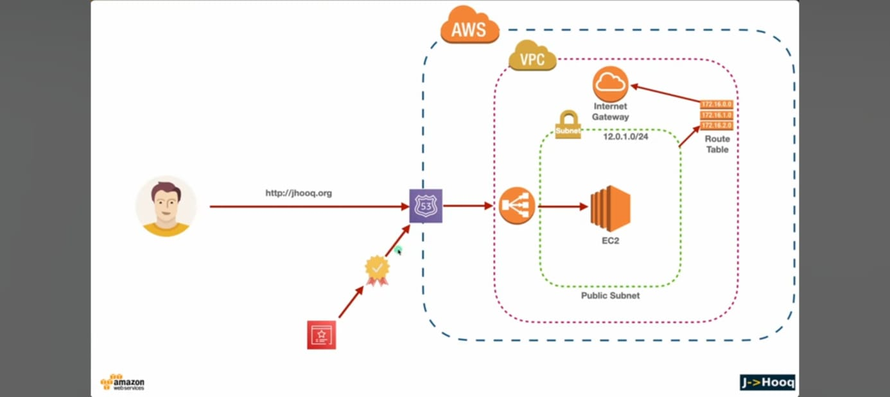
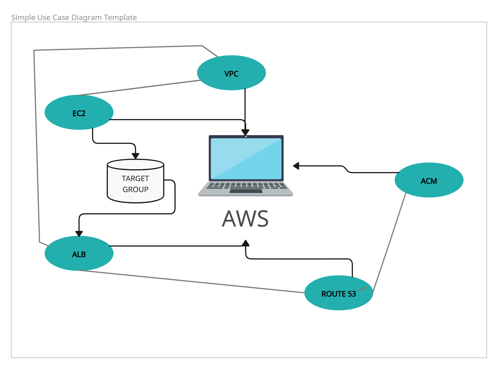
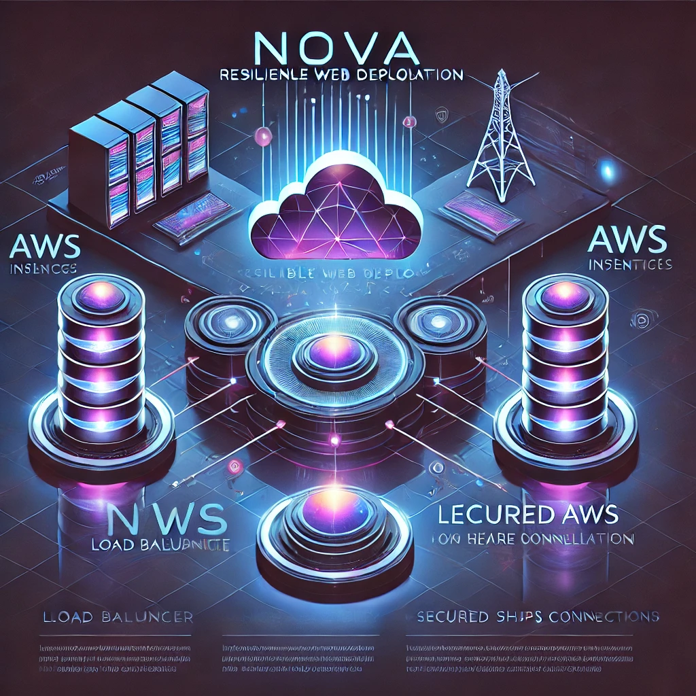
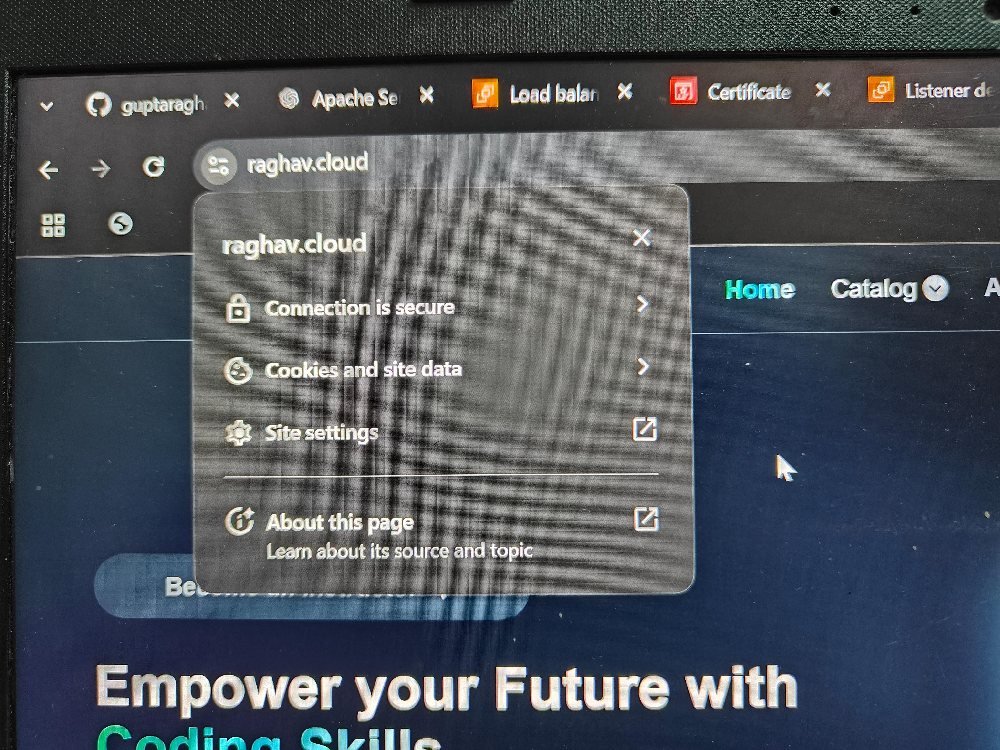
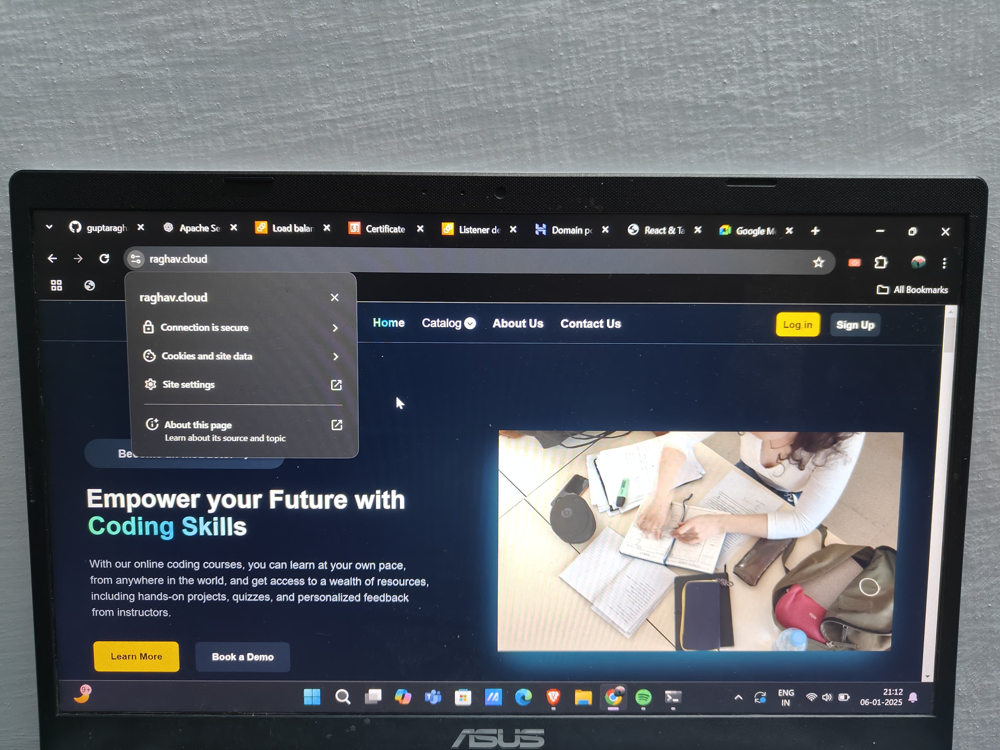

<h1 align="center" id="title">Nova ~ Resilient Web Deployment</h1>

"Nova ~ Resilient Web Deployment" suggests a solution that is robust stands out and shines with reliability and innovation.A high-availability and fault-tolerant web deployment solution on AWS. This project demonstrates the use of multiple EC2 instances load balancing and HTTPS encryption for secure and scalable web hosting.

  
  
  

  
  
    

<h2>🚀 Demo</h2>

Experience the live version of the project here: https://raghav.cloud

<h2>Architecture:</h2>

<!-- First Image: Full Size -->

<!-- Second Row: Two Smaller Images side by side with equal space -->

  
  

<!-- Third Row: Two Smaller Images side by side with equal space -->

  
  

  
  
<h2>🧐 Features</h2>

Here're some of the project's best features:

*   Fault-Tolerant Architecture: Dual EC2 instances behind an Elastic Load Balancer (ELB).
*   Automatic Failover: Traffic redirection in case of instance failure.
*   HTTPS Security: Encrypted connection using AWS Certificate Manager (ACM).
*   Scalability: Ready for scaling with minimal setup.

<h2>🛠️ Installation Steps:</h2>

1. Clone the repository:

git clone https://github.com/guptaraghav81/codingAndcoffee.git

2. Set up EC2 instances: Launch two EC2 instances within your AWS account. Ensure they are in your custom VPC for better network isolation and security.

3. Create a custom VPC: Create a Virtual Private Cloud (VPC) with subnets route tables and security groups to define network isolation.

4. Configure Elastic Load Balancer (ELB): Set up an Elastic Load Balancer (ELB) to distribute traffic evenly between the two EC2 instances.

5. Set up Route 53: Use Amazon Route 53 to configure your domain and link it to the ELB for seamless DNS resolution.

6. Test Failover: To ensure high availability manually stop one EC2 instance and verify that traffic is redirected to the remaining healthy instance.

<h2>🍰 Contribution Guidelines:</h2>

Thank you for your interest in contributing to Nova: Resilient Web Deployment! We welcome all contributions that enhance the project's features documentation and overall functionality. Please follow these guidelines to ensure a smooth contribution process.  
1\. Contribution Types :- Here are some ways you can contribute:  
💭 Fix bugs or add new features.  
💭 Improve documentation.  
💭 Optimize performance.  
💭 Add examples or tests for the deployment process.  
2\. Review Process:-  
💭 All pull requests will be reviewed by maintainer.  
💭 Feedback will be provided if changes are required.  
💭 Once approved your pull request will be merged into the main branch.  
3\. Need Help?  
💭 If you need assistance feel free to open an issue or reach out via discussions.

  
  
<h2>💻 Built with:</h2>

Technologies used in the project:

*   Amazon EC2: For hosting the website.
*   Elastic Load Balancer (ELB): To distribute traffic evenly across instances.
*   AWS Certificate Manager (ACM): For SSL certificates.
*   Route 53 (DNS): For domain name resolution.
*   Amazon VPC: Your custom Virtual Private Cloud for network isolation security and connectivity.

<h2>💖Like my work?</h2>

If you encounter any issues or need assistance with this project please feel free to reach out using the following method:  
Contact Email: cloud@raghav 💭
